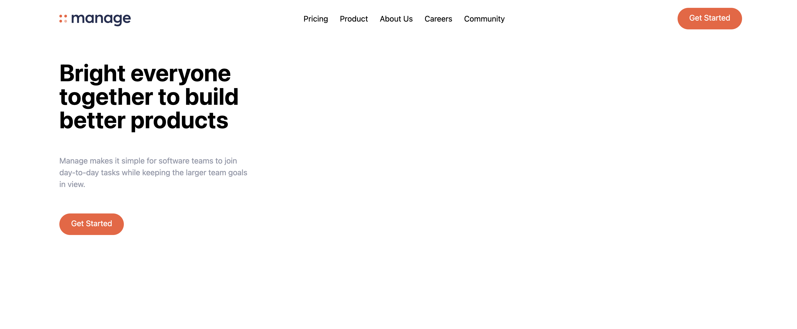
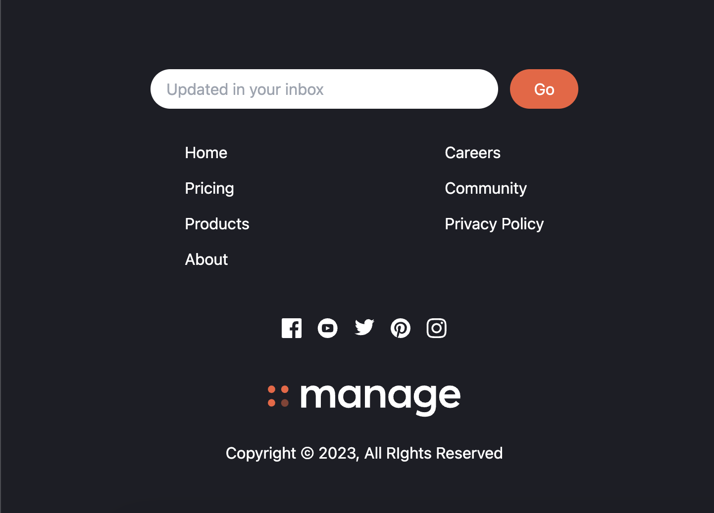

# Manage Landing Page
Built with tailwind css
Tutorial URL: https://www.youtube.com/watch?v=dFgzHOX84xQ
Tutorial description: In this video, we will set up Tailwind CLI and create a landing page from start to finish, going over many of the common utility classes and then deploying it to InMotion Hosting using Git.

___________

### Software versions

### Problems in the project:
1.
2.

### How to use

### Photos of project:

### Apps used:
[Sublime Text](https://www.sublimetext.com/)
[Firefox Developer Edition](https://www.mozilla.org/en-US/firefox/developer/)

### Coding styles I used:

### What I learned:
1. Tailwind CSS is relatively easy to setup. It has classes you tail into HTML elements but Tailwind doesn't have functionality to view the website in the browser by a server.
2. You can set breakpoints for the website and color variables in a JSON file.
3. Tailwind is simply another framework with it's own ways of building websites. It's for those who compare frameworks as tools often and develop preferences or quirks to what tools to use to build a website. It's like another tool in the gigantic industry of CSS frameworks.
3. What a hero section is in a website and how important it is in web design. 

